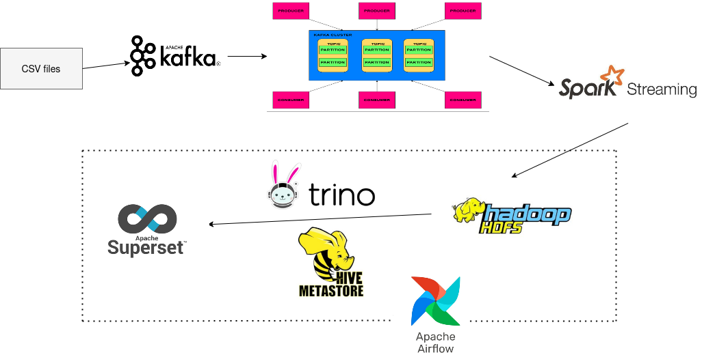

# Real-Time Credit Card Transaction Processing with Kafka, Spark, Hive, Trino, and Superset

This project demonstrates a real-time data processing pipeline for credit card transactions using a combination of modern data engineering tools. The pipeline reads transaction data from a CSV file, processes it using Kafka and Spark Streaming, stores the processed data in HDFS, and makes it available for querying via Hive and Trino. Finally, Apache Superset is used for data visualization and dashboarding, with Airflow scheduling dataset refreshes.

## Architect

## Overview

The pipeline consists of the following components:

1. **Kafka Producer**: Reads credit card transaction data from a CSV file and sends each record to a Kafka topic.
2. **Spark Streaming Consumer**: Consumes the data from the Kafka topic, processes it, and writes it to HDFS.
3. **Hive Metastore**: Defines the schema for the data stored in HDFS and provides a table structure for querying.
4. **Trino**: Acts as a SQL engine to query the data stored in HDFS via Hive.
5. **Apache Superset**: Connects to Trino to create datasets, charts, and dashboards for data visualization.
6. **Airflow**: Schedules periodic refreshes of the dataset in Superset.

## Prerequisites

Before running the pipeline, ensure you have the following installed and configured:

- **Kafka**: For message brokering.
- **Spark**: For stream processing.
- **HDFS**: For distributed storage.
- **Hive**: For metadata management.
- **Trino**: For SQL querying.
- **Apache Superset**: For data visualization.
- **Airflow**: For workflow scheduling.

## Project Structure

The project is organized as follows:
```
├── Producer.py # Kafka Producer script
├── Consumer.py # Spark Streaming Consumer script
├── create_db_tables_hive.txt # Hive table creation commands
├── connect_hiveserver2.txt # Commands to connect to HiveServer2
├── offset_producer.txt # Offset tracking for the producer
├── rate_VND.py # Script to fetch USD to VND exchange rate
├── Superset_Hive.txt # Superset and HDFS commands
├── Refresh_Data.py # Airflow DAG for refreshing Superset dataset
└── README.md # This file
```


## Setup and Execution

### 1. Kafka Producer

The `Producer.py` script reads credit card transaction data from `credit_card_transactions-ibm_v2.csv` and sends each record to the `stream_credits` Kafka topic.
```bash
python Producer.py
```
### 2. Spark Streaming Consumer
The `Consumer.py` script consumes the data from the stream_credits Kafka topic, processes it, and writes the transformed data to HDFS.
```bash
spark-submit Consumer.py
```

### 3. Hive Metastore
In terminal, i will run hive metastore, hive server2 with the following command lines

- Run hive metastore
``` sh
apache-hive/bin hive --service metastore
```
- Run hive server2
``` sh
apache-hive/bin hive --service hiveserver2
```
- Create database, and external table which points to HDFS dir is automatically updated if data in HDFS is updated

```bash
CREATE DATABASE IF NOT EXISTS uses_of_credits;
```
```bash
USE uses_of_credits;
```
``` bash
CREATE EXTERNAL TABLE uses_of_credits.credit_card_transactions (
`User` INT,
`Card` INT,
`Time` STRING,
`Amount` DOUBLE,
`Use Chip` STRING,
`Merchant Name` STRING,
`Merchant City` STRING,
`Merchant State` STRING,
`Zip` DOUBLE,
`MCC` INT,
`Errors?` STRING,
`Is Fraud?` STRING,
`Date` STRING
)
ROW FORMAT SERDE 'org.apache.hadoop.hive.serde2.OpenCSVSerde'
WITH SERDEPROPERTIES (
'separatorChar' = ',',
'quoteChar' = '"',
'escapeChar' = '\\'
)
STORED AS TEXTFILE
LOCATION 'hdfs://localhost:9000/user/nngiaminh1812/hive/warehouse/uses_of_credits.db/credit_card_transactions'
TBLPROPERTIES ("skip.header.line.count"="1")
```

### 4. Trino server and CLI
Start Trino and connect to the Hive metastore to query the data.
```bash
./start-trino.sh

./trino-cli --server localhost:8080 --user nngiaminh1812 --catalog hive --schema uses_of_credits
```
In Trino CLI:
- I use below SQL query to count current number of samples in tables
```bash
SELECT COUNT(*) as total_record from credit_card_transactions;
```
- Create a view with matched schema for later using in Trino CLI
```bash
CREATE VIEW uses_of_credits.credit_card_transactions_typed AS
    SELECT
        CAST("user" AS INTEGER) AS "user",
        CAST("card" AS INTEGER) AS "card",
        CAST("time" AS VARCHAR) AS "time",
        CAST("amount" AS DOUBLE) AS "amount",
        CAST("use chip" AS VARCHAR) AS "use chip",
        CAST("merchant name" AS VARCHAR) AS "merchant name",
        CAST("merchant city" AS VARCHAR) AS "merchant city",
        CAST("merchant state" AS VARCHAR) AS "merchant state",
        CAST("zip" AS DOUBLE) AS "zip",
        CAST("mcc" AS INTEGER) AS "mcc",
        CAST("errors?" AS VARCHAR) AS "errors?",
        CAST("is fraud?" AS VARCHAR) AS "is fraud?",
        CAST("date" AS VARCHAR) AS "date"
    FROM uses_of_credits.credit_card_transactions;
```
### 5. Apache Superset
Start Superset and connect to Trino to create datasets, charts, and dashboards.
```bash
superset run -p 5000 --with-threads --reload --debugger
```
- Create database connection (navigate to Setting, Create database):
```bash
trino://nngiaminh1812@localhost:8080/uses_of_credits
```
- Create dataset to use for charts, dashboards:
Choose database name which is created in above step, then schema uses_of_credis, finally credi_card_transactions_typed view

### 6. Airflow DAG
The Refresh_Data.py script defines an Airflow DAG to periodically refresh the dataset in Superset.
(Note: Refresh_Data.py is presented in dags folder which is mounted in airflow.cfg)

- Run Airflow Scheduler:
```bash
airflow scheduler
```
- Run Airflow Webserver on port 8081 (port 8080 used by Trino server)
```bash
airflow webserver -p 8081
```
- Finally, trigger DAG to observe dataset refresh running successfully with superset response 200 in terminal where I run superset webserver.

## Link to my demo video
[Real-Time Credit Card Transaction Processing with Kafka, Spark, Hive, Trino, and Superset](https://youtu.be/kPaLRgRXMuE)